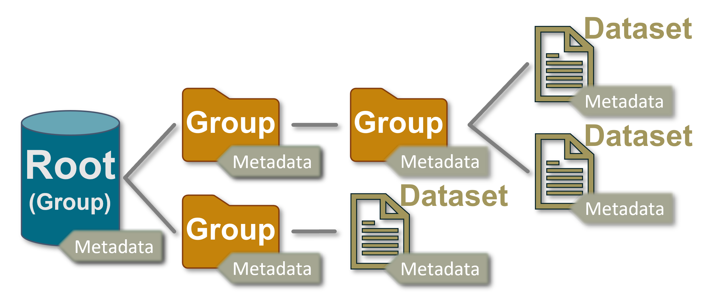

# Overview

`msl-io` follows the data model used by [HDF5]{:target="_blank"} to read and write data files &mdash; where there are [Groups][msl-io-group] and [Datasets][msl-io-dataset] and each item has [Metadata][msl-io-metadata].



The tree structure is similar to the file-system structure used by operating systems. [Groups][msl-io-group] are analogous to directories (where [Root][msl.io.base.Root] is the root [Group][msl-io-group]) and [Datasets][msl-io-dataset] are analogous to files.

The data files that can be read or written are not restricted to [HDF5]{:target="_blank"} files, but any file format that has a [Reader][msl-io-readers] implemented can be read and data files can be created using any of the [Writers][msl-io-writers].

## Write a file

<!-- invisible-code-block: pycon
>>> from pathlib import Path
>>> Path("my_file.h5").unlink(missing_ok=True)
>>> Path("my_file.json").unlink(missing_ok=True)
>>> Path("my_table.csv").unlink(missing_ok=True)
>>> SKIP_IF_NO_H5PY()

-->

Suppose you want to create a new [JSON]{:target="_blank"} file format. We first create an instance of [JSONWriter][msl.io.writers.json_.JSONWriter]

```pycon
>>> from msl.io import JSONWriter
>>> root = JSONWriter()

```

then we can add [Metadata][msl-io-metadata] to the `root` [Root][msl.io.base.Root],

```pycon
>>> root.add_metadata(one=1, two=2)

```

create a [Dataset][msl-io-dataset],

```pycon
>>> dataset1 = root.create_dataset("dataset1", data=[1, 2, 3, 4])

```

create a [Group][msl-io-group],

```pycon
>>> my_group = root.create_group("my_group")

```

and create a [Dataset][msl-io-dataset] in `my_group`

```pycon
>>> dataset2 = my_group.create_dataset("dataset2", data=[[1, 2], [3, 4]], three=3)

```

If the parent [Group][msl-io-group]s do not exist, they are created

```pycon
>>> dataset3 = root.create_dataset("group1/group2/group3/dataset3", data=[9, 8, 7])

```


Finally, we write the file

```pycon
>>> root.write(file="my_file.json")

```

!!! note
    The file is not created until you call the [write][msl.io.base.Writer.write] (or [save][msl.io.base.Writer.save]) method.

## Read a file

The [read][msl.io.read] function is available to read a file. Provided that a [Reader][msl-io-readers] subclass has been implemented to read the file, the subclass instance is returned. We will now read the file that we created above

```pycon
>>> from msl.io import read
>>> root = read("my_file.json")

```

You can print a _tree_ representation of all [Group][msl-io-group]s and [Dataset][msl-io-dataset]s in the [Root][msl.io.base.Root] by calling the [tree][msl.io.base.Root.tree] method

```pycon
>>> print(root.tree())
<JSONReader 'my_file.json' (4 groups, 3 datasets, 2 metadata)>
  <Dataset '/dataset1' shape=(4,) dtype='<f8' (0 metadata)>
  <Group '/group1' (2 groups, 1 datasets, 0 metadata)>
    <Group '/group1/group2' (1 groups, 1 datasets, 0 metadata)>
      <Group '/group1/group2/group3' (0 groups, 1 datasets, 0 metadata)>
        <Dataset '/group1/group2/group3/dataset3' shape=(3,) dtype='<f8' (0 metadata)>
  <Group '/my_group' (0 groups, 1 datasets, 0 metadata)>
    <Dataset '/my_group/dataset2' shape=(2, 2) dtype='<f8' (1 metadata)>

```

Since the `root` item is a [Group][msl-io-group] instance (which operates like a Python [dict][]) you can iterate over the items that are in the file

```pycon
>>> for name, node in root.items():
...     print(f"{name!r} -- {node!r}")
'/dataset1' -- <Dataset '/dataset1' shape=(4,) dtype='<f8' (0 metadata)>
'/my_group' -- <Group '/my_group' (0 groups, 1 datasets, 0 metadata)>
'/my_group/dataset2' -- <Dataset '/my_group/dataset2' shape=(2, 2) dtype='<f8' (1 metadata)>
'/group1' -- <Group '/group1' (2 groups, 1 datasets, 0 metadata)>
'/group1/group2' -- <Group '/group1/group2' (1 groups, 1 datasets, 0 metadata)>
'/group1/group2/group3' -- <Group '/group1/group2/group3' (0 groups, 1 datasets, 0 metadata)>
'/group1/group2/group3/dataset3' -- <Dataset '/group1/group2/group3/dataset3' shape=(3,) dtype='<f8' (0 metadata)>

```

where *node* will either be a [Group][msl-io-group] or a [Dataset][msl-io-dataset].

You can iterate only over the [Group][msl-io-group]s that are in the file

```pycon
>>> for group in root.groups():
...     print(group)
<Group '/my_group' (0 groups, 1 datasets, 0 metadata)>
<Group '/group1' (2 groups, 1 datasets, 0 metadata)>
<Group '/group1/group2' (1 groups, 1 datasets, 0 metadata)>
<Group '/group1/group2/group3' (0 groups, 1 datasets, 0 metadata)>

```

or iterate over the [Dataset][msl-io-dataset]s

```pycon
>>> for dataset in root.datasets():
...     print(repr(dataset))
<Dataset '/dataset1' shape=(4,) dtype='<f8' (0 metadata)>
<Dataset '/my_group/dataset2' shape=(2, 2) dtype='<f8' (1 metadata)>
<Dataset '/group1/group2/group3/dataset3' shape=(3,) dtype='<f8' (0 metadata)>

```

You can access the [Metadata][msl-io-metadata] of any item through the `metadata` attribute

```pycon
>>> print(root.metadata)
<Metadata '/' {'one': 1, 'two': 2}>

```

You can access values of the [Metadata][msl-io-metadata] as attributes

```pycon
>>> dataset2.metadata.three
3

```

or as keys

```pycon
>>> dataset2.metadata["three"]
3

```

When `root` is returned, it is accessed in read-only mode

```pycon
>>> root.read_only
True
>>> for name, node in root.items():
...     print(f"is {name!r} in read-only mode? {node.read_only}")
is '/dataset1' in read-only mode? True
is '/my_group' in read-only mode? True
is '/my_group/dataset2' in read-only mode? True
is '/group1' in read-only mode? True
is '/group1/group2' in read-only mode? True
is '/group1/group2/group3' in read-only mode? True
is '/group1/group2/group3/dataset3' in read-only mode? True

```

If you want to edit the [Metadata][msl-io-metadata] of `root`, or modify any [Group][msl-io-group]s or [Dataset][msl-io-dataset]s in `root`, then you must first set the item to be writeable. Setting the read-only mode of `root` propagates that mode to all items within `root`. For example,

```pycon
>>> root.read_only = False

```

will make `root` and all sub-[Group][msl-io-group]s and all sub-[Dataset][msl-io-dataset]s within `root` to be writeable

```pycon
>>> for name, node in root.items():
...     print(f"is {name!r} in read-only mode? {node.read_only}")
is '/dataset1' in read-only mode? False
is '/my_group' in read-only mode? False
is '/my_group/dataset2' in read-only mode? False
is '/group1' in read-only mode? False
is '/group1/group2' in read-only mode? False
is '/group1/group2/group3' in read-only mode? False
is '/group1/group2/group3/dataset3' in read-only mode? False

```

You can make only a specific item (and its descendants) writeable as well. You can make `my_group` and `dataset2` to be in read-only mode by the following (recall that `root` behaves like a Python [dict][])

```pycon
>>> root["my_group"].read_only = True

```

and this will keep `root`, `dataset1` and all items contained within the `group1` [Group][msl-io-group] to be in read-write mode, but change `my_group` and `dataset2` to be in read-only mode

```pycon
>>> root.read_only
False
>>> for name, node in root.items():
...     print(f"is {name!r} in read-only mode? {node.read_only}")
is '/dataset1' in read-only mode? False
is '/my_group' in read-only mode? True
is '/my_group/dataset2' in read-only mode? True
is '/group1' in read-only mode? False
is '/group1/group2' in read-only mode? False
is '/group1/group2/group3' in read-only mode? False
is '/group1/group2/group3/dataset3' in read-only mode? False

```

You can access [Group][msl-io-group]s and [Dataset][msl-io-dataset]s as keys or as class attributes

```pycon
>>> root["my_group"]["dataset2"].shape
(2, 2)
>>> root.my_group.dataset2.shape
(2, 2)

```

See [Accessing Keys as Class Attributes][attribute-key-limitations] for more information.

## Convert a file

You can convert between file formats using any of the [Writers][msl-io-writers]. Suppose you had a file in the [JSON]{:target="_blank"} format and you wanted to convert it to the [HDF5]{:target="_blank"} format

```pycon
>>> from msl.io import HDF5Writer
>>> h5 = HDF5Writer("my_file.h5")
>>> h5.write(root=read("my_file.json"))

```

## GTC Archive

You can store and retrieve a [GTC Archive][persistence.Archive]{:target="_blank"} so that uncertain numbers can be used in later calculations.

```python
>>> from GTC import pr, ureal
>>> from msl.io import JSONWriter, read

# Create an Archive
>>> archive = pr.Archive()
>>> archive.add(x=ureal(1, 0.1))

# Write the Archive as metadata (using any Writer is okay)
>>> with JSONWriter("archived.json") as w:
...     w.add_metadata(archive=pr.dumps_json(archive))

# Read the file and load the Archive from metadata
>>> root = read("archived.json")
>>> archive = pr.loads_json(root.metadata.archive)
>>> archive["x"]
ureal(1.0,0.1,inf)

```

## Read a table

The [read_table][msl.io.read_table] function will read tabular data from a file. A *table* has the following properties:

1. The first row is a header
2. All rows have the same number of columns
3. All values in a column have the same data type

The returned item is a [Dataset][msl-io-dataset] with the header provided in the [Metadata][msl-io-metadata]. You can read a table from a text-based file or from a spreadsheet.

For example, suppose a file named *my_table.txt* contains the following information

<table>
   <tr>
      <th>x</th>
      <th>y</th>
      <th>z</th>
   </tr>
   <tr>
      <td>1</td>
      <td>2</td>
      <td>3</td>
   </tr>
   <tr>
      <td>4</td>
      <td>5</td>
      <td>6</td>
   </tr>
   <tr>
      <td>7</td>
      <td>8</td>
      <td>9</td>
   </tr>
</table>

<!-- invisible-code-block: pycon
>>> with open('my_table.txt', mode='wt') as f:
...    for row in [['x','y','z'],[1,2,3],[4,5,6],[7,8,9]]:
...        dump = f.write(' '.join(str(item) for item in row) + '\n')

-->

You can read this table using the [read_table][msl.io.read_table] function

```pycon
>>> from msl.io import read_table
>>> table = read_table("my_table.txt")
>>> table
<Dataset 'my_table.txt' shape=(3, 3) dtype='<f8' (1 metadata)>
>>> table.metadata
<Metadata 'my_table.txt' {'header': ['x', 'y', 'z']}>
>>> table.data
array([[1., 2., 3.],
       [4., 5., 6.],
       [7., 8., 9.]])

```

and since a [Dataset][msl-io-dataset] behaves like a numpy [ndarray][numpy.ndarray]{:target="_blank"}, you can call [ndarray][numpy.ndarray]{:target="_blank"} attributes directly with the `table` instance

```pycon
>>> table.shape
(3, 3)
>>> print(table.max())
9.0

```

You can define the [dtype][numpy.dtype]{:target="_blank"} of each column. For example, to return integer values instead of floating-point numbers you can include the `dtype=int` keyword argument

```pycon
>>> table = read_table("my_table.txt", dtype=int)
>>> table.dtype
dtype('int64')

```

and the `dtype` value is passed to the [dtype][numpy.dtype]{:target="_blank"} constructor.

However, if you specify the `dtype` value as a string which starts with the text `header`, then the values in the *header* are used as field names for the [structured array][structured_arrays]{:target="_blank"} that is created where each data type is by default a [double][numpy.double]{:target="_blank"} *(note: the header is still included as metadata)*

```pycon
>>> table = read_table("my_table.txt", dtype="header")
>>> table.dtype
dtype([('x', '<f8'), ('y', '<f8'), ('z', '<f8')])
>>> table.x
array([1., 4., 7.])

```

You can also specify the data type to use for all columns by specifying `header:` followed by the data type

```pycon
>>> table = read_table("my_table.txt", dtype="header:f4")
>>> table.dtype
dtype([('x', '<f4'), ('y', '<f4'), ('z', '<f4')])
>>> table.y
array([2., 5., 8.], dtype=float32)

```

or you can specify the data type of each column by separating each data type with a comma

```pycon
>>> table = read_table("my_table.txt", dtype="header:f4,f8,H")
>>> table.dtype
dtype([('x', '<f4'), ('y', '<f8'), ('z', '<u2')])
>>> table.z
array([3, 6, 9], dtype=uint16)

```

See [Specifying and constructing data types][arrays.dtypes.constructing]{:target="_blank"} for the character and string representations of the different data types that numpy supports.

### Extension-delimiter map

Suppose you wanted to read a table from files that use a `;` character to separate columns

<!--
>>> from io import StringIO
>>> file = StringIO("value;uncertainty\n6.317;0.045\n4.362;0.009\n5.328;0.013\n")
>>> file.name = "data.xyz"

-->

```pycon
>>> file.name
'data.xyz'
>>> print(file.read())
value;uncertainty
6.317;0.045
4.362;0.009
5.328;0.013

```

<!--
>>> _ = file.seek(0)

-->

You can add the extension and delimiter to the [extension_delimiter_map][msl.io.tables.extension_delimiter_map]

```pycon
>>> from msl.io import extension_delimiter_map
>>> extension_delimiter_map[".xyz"] = ";"

```

and then you can read a table from files with the *.xyz* extension without needing to explicitly specify the delimiter to use every time you read a table

```pycon
>>> table = read_table(file)
>>> table.metadata
<Metadata 'data.xyz' {'header': ['value', 'uncertainty']}>
>>> table.data
array([[6.317, 0.045],
       [4.362, 0.009],
       [5.328, 0.013]])

```

<!-- invisible-code-block: pycon
>>> import os
>>> os.remove("my_file.h5")
>>> os.remove("my_file.json")
>>> os.remove("my_table.txt")
>>> os.remove("archived.json")

-->

[HDF5]: https://www.hdfgroup.org/
[JSON]: https://www.json.org/
