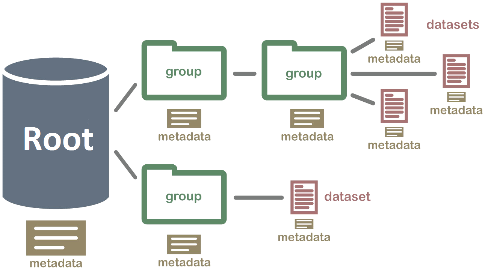

.. _msl-io-welcome:

======
MSL-IO
======

Read and write MSL data files.

**MSL-IO** follows the data model used by HDF5_, where there is a :class:`~msl.io.base_io.Root`,
:ref:`msl-io-group`\s and :ref:`msl-io-dataset`\s and these objects each have :ref:`msl-io-metadata`
associated with them.

The data files that can be read are not restricted to HDF5_ files, but, rather any
file format that has a :ref:`Reader <io-readers>` class implemented can be read.

**Getting Started:**

* :ref:`msl-io-read`
* :ref:`msl-io-write`
* :ref:`msl-io-convert`
* :ref:`msl-io-read-table`

.. _msl-io-read:

Read a File
------------
The :func:`~msl.io.read` function is used to read a file

.. code-block:: pycon

    >>> from msl.io import read
    >>> root = read('/path/to/a/data.file')

Provided that a :class:`~msl.io.base_io.Reader` exists to read the file a :class:`~msl.io.base_io.Root`
object is returned.

Since the ``root`` object is a :ref:`msl-io-group` (which operates like a Python dictionary) you can inspect the
items that are in the file using

.. code-block:: pycon

    >>> for name, value in root.items():
            print(name, repr(value))

where, `value` will be of type :class:`~msl.io.group.Group` or :class:`~msl.io.dataset.Dataset`.

Or view the metadata for `root`

.. code-block:: pycon

    >>> root.metadata

If you only wanted to see what :class:`~msl.io.group.Group`\s are in the file

.. code-block:: pycon

    >>> for group in root.groups():
            print(group)

If you only wanted to see what :class:`~msl.io.dataset.Dataset`\s are in the file

.. code-block:: pycon

    >>> for dataset in root.datasets():
            print(repr(dataset))

When ``root`` is returned it is accessed, by default, in read-only mode. If you want to edit the
:class:`~msl.io.metadata.Metadata` for ``root``, or modify any sub-:class:`~msl.io.group.Group`\s or
sub-:class:`~msl.io.dataset.Dataset`\s in ``root``, then you must first set the object to be writable.

Setting the read-only mode of ``root`` propagates that mode to all items within ``root``. For example,

.. code-block:: pycon

    >>> root.is_read_only = False

will make ``root`` and all sub-:class:`~msl.io.group.Group`\s and all sub-:class:`~msl.io.dataset.Dataset`\s
within ``root`` to be writable.

You can make only a specific object (and it's sub members) writeable as well. Assuming that ``root`` contains a
:class:`~msl.io.group.Group` called ``'my_group'`` and a :class:`~msl.io.dataset.Dataset` called ``'my_dataset'``
you can make ``'my_dataset'`` writeable by

.. code-block:: pycon

    >>> root['my_dataset'].is_read_only = False

and this will keep ``root`` and ``root['my_group']`` in read-only mode.

You can also access the keys in ``root`` (recall that ``root`` behaves like a Python dictionary)
as class attributes

.. code-block:: pycon

    >>> root.my_dataset.is_read_only = False

See :ref:`attribute-key-limitations` for more information.

.. _msl-io-write:

Write a File
------------
Suppose you want to create a new HDF5_ file. We create an instance of
:class:`~msl.io.writers.hdf5.HDF5Writer`

.. code-block:: pycon

   >>> from msl.io import HDF5Writer
   >>> h5 = HDF5Writer()

then we can add :class:`~msl.io.metadata.Metadata` to the :class:`~msl.io.base_io.Root`,

.. code-block:: pycon

   >>> h5.add_metadata(one=1, two=2)

add a :class:`~msl.io.dataset.Dataset` to the :class:`~msl.io.base_io.Root`,

.. code-block:: pycon

   >>> my_dataset = h5.create_dataset('my_dataset', data=[1, 2, 3, 4])

create a :class:`~msl.io.group.Group`,

.. code-block:: pycon

   >>> my_group = h5.create_group('my_group')

and, add a :class:`~msl.io.dataset.Dataset` to ``my_group``

.. code-block:: pycon

   >>> my_dataset2 = my_group.create_dataset('my_dataset2', data=[[1, 2], [3, 4]])

To write the file use *(NOTE: the file is not created until you call the* ``write`` *method)*

.. code-block:: pycon

   >>> h5.write(url='my_file.h5')

.. _msl-io-convert:

Convert a File
--------------
You can convert between file formats using any of the :ref:`Writers <io-writers>`.
Suppose you had an HDF5_ file and you wanted to convert it to the JSON_ format,

.. code-block:: pycon

   >>> from msl.io import JSONWriter
   >>> h5 = read('my_file.h5')
   >>> writer = JSONWriter('my_file.json')
   >>> writer.write(root=h5)

.. _msl-io-read-table:

Read a Tabular File
-------------------
The :func:`~msl.io.read_table` function is used to read a table from a file.

A *table* has the following properties:

1. The first row is a header.
2. All rows have the same number of columns.
3. All values in a column are of the same data type.

The returned object is a :class:`~msl.io.dataset.Dataset` with the header provided as metadata.

Read a table from a text-based file

.. code-block:: pycon

    >>> from msl.io import read_table
    >>> dataset = read_table('my_data.csv')

or from an Excel spreadsheet

.. code-block:: pycon

    >>> from msl.io import read_table
    >>> dataset = read_table('my_data.xlsx', cell='B2:H26')

========
Contents
========

.. toctree::
   :maxdepth: 1

   Install <install>
   Group <group>
   Dataset <dataset>
   Metadata <metadata>
   readers
   writers
   attribute_access
   API <api_docs>
   License <license>
   Authors <authors>
   Release Notes <changelog>

=====
Index
=====

* :ref:`modindex`

.. _HDF5: https://www.hdfgroup.org/
.. _JSON: https://www.json.org/
